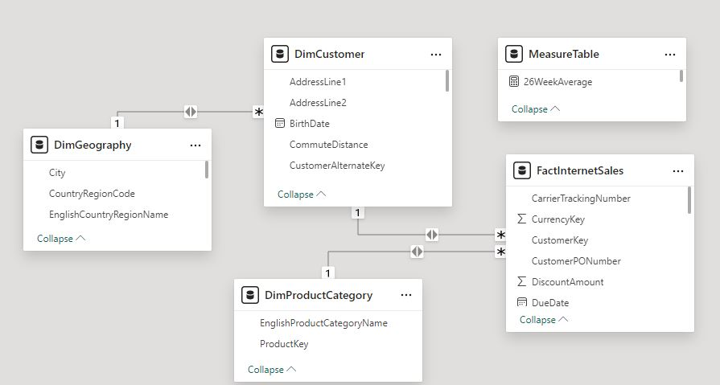

# Sales Report Analysis

## Project Overview:
This sales report analysis covers the period from 2010 to 2014, utilizing data extracted from the AdventureWorksDW2022 database. The primary goal of this project is to provide comprehensive insights into sales performance and trends over the specified period, using Power BI for visualization and analysis.

## Skills/ concepts demonstrated:
- Data extraction and transformation using SQL.
- Advanced data analysis and visualization with Power BI.
- Application of DAX for detailed and dynamic business insights.

## Data Source:
The data was sourced from SQL Server Management Studio, specifically from the _AdventureWorksDW2022_ database. The following tables were used:
- DimCustomer
- DimGeography
- DimProductCategory 
*A LEFT JOIN query was employed to combine the DimProductCategory table:*

<pre>
SELECT DimProduct.ProductKey, DimProductCategory.EnglishProductCategoryName
FROM DimProduct
LEFT JOIN DimProductSubcategory
ON DimProductSubcategory.ProductSubcategoryKey = DimProduct.ProductSubcategoryKey
LEFT JOIN DimProductCategory
ON DimProductCategory.ProductCategoryKey = DimProductSubcategory.ProductCategoryKey;
  </pre>

- FactInternetSales

<pre>
SELECT * FROM FactInternetSales
ORDER BY UnitPrice
  </pre>

## Data Model:
A data model was created by establishing relationships between these tables to enhance the dataset for analysis. Specifically:

- DimCustomer was linked to FactInternetSales through the "CustomerKey".
- DimGeography was linked to DimCustomer through the "GeographyKey".
- DimProductCategory was linked to FactInternetSales through the "ProductKey". 

These relationships enabled a more comprehensive analysis, allowing for meaningful insights by connecting customer, product, location, and sales data across the dataset.

## The purpose of this analysis is to:
1. Evaluate Total Sales and Total Orders: Understand overall sales performance and order volumes.
2. Analyze Sales Trends: Examine sales trends on a weekly basis (1 week, 4 weeks, 26 weeks, 52 weeks) using DAX.
3. Calculate Running Totals: Provide insights into cumulative sales performance over time.
4. Transaction Analysis by Product: Identify which products are driving sales.
5. Geographical Sales Analysis: Determine average sales amounts by country to understand geographical performance.

## Analysis and Visualization
### 1. Total Sales and Total Orders
- Insight: Provides a high-level overview of sales volumes and order counts over the four-year period.
  
### 2. Sales by Week (1 week, 4 weeks, 26 weeks, 52 weeks)
- Insight: Helps identify short-term and long-term sales trends, seasonal patterns, and potential anomalies.

### 3. Running Total by Week
- Insight: Shows the cumulative sales growth over time, allowing for easy identification of periods with significant growth or decline.

### 4. Transaction by Product
- Insight: Highlights the top-performing products and categories, aiding in inventory and marketing strategy decisions.

### 5. Average Amount by Country
- Insight: Reveals geographical disparities in sales performance, guiding regional sales strategies.

## DAX Formulas Used in Creating Measures and Calculated Columns
- Total Sales:
<pre>
TotalSales = SUM(FactInternetSales[SalesAmount])
  </pre>

- Total Orders:
<pre>
TotalSales = COUNTROWS(FactInternetSales)
  </pre>

- Sales by Week:
<pre>
Sales4Weeks = CALCULATE(
    SUM(FactInternetSales[SalesAmount]),
    DATESINPERIOD(FactInternetSales[WeekDate], LASTDATE(FactInternetSales[WeekDate]), -28, DAY)
)
/
CALCULATE(
    DISTINCTCOUNT(FactInternetSales[WeekDate]),
    DATESINPERIOD(FactInternetSales[WeekDate], LASTDATE(FactInternetSales[WeekDate]), -28, DAY)
)
  
Sales26Weeks = CALCULATE(
    SUM(FactInternetSales[SalesAmount]),
    DATESINPERIOD(FactInternetSales[WeekDate], LASTDATE(FactInternetSales[WeekDate]), -182, DAY)
)
/
CALCULATE(
    DISTINCTCOUNT(FactInternetSales[WeekDate]),
    DATESINPERIOD(FactInternetSales[WeekDate], LASTDATE(FactInternetSales[WeekDate]), -182, DAY)
)
  
Sales52Weeks = CALCULATE(
    SUM(FactInternetSales[SalesAmount]),
    DATESINPERIOD(FactInternetSales[WeekDate], LASTDATE(FactInternetSales[WeekDate]), -365, DAY)
)
/
CALCULATE(
    DISTINCTCOUNT(FactInternetSales[WeekDate]),
    DATESINPERIOD(FactInternetSales[WeekDate], LASTDATE(FactInternetSales[WeekDate]), -365, DAY)
)
  </pre>

- Running Total by Week:
<pre>
CALCULATE(
    COUNT(FactInternetSales[CustomerKey]), 
    FILTER(
        ALLSELECTED(FactInternetSales),
        FactInternetSales[WeekDate] <= MAX(FactInternetSales[WeekDate])
    )
)
  </pre>

 - Week Date:
<pre>
  WeekDate = FactInternetSales[OrderDate] + (7 - WEEKDAY(FactInternetSales[OrderDate]))
  </pre>

## Dashboard

## Vital Recommendations
1. *Monitor and Optimize Sales Trends:* The sales trend shows significant growth in recent years, especially in 2013 and early 2014. Maintain the momentum by identifying and replicating successful strategies used during this period, such as seasonal promotions or new product launches.
 
2. *Capitalize on High-Performing Categories:* Accessories are the leading product category, contributing significantly to total sales. Focus on expanding this product line and related marketing efforts to maintain growth.
 
3. *Product Prioritization:* While clothing and bikes are key contributors, accessories have a smaller share. Explore opportunities to diversify and increase sales in underperforming categories, perhaps by bundling them with more popular products or offering targeted promotions.

4. *Customer Segmentation Focus:* The filters for gender, occupation, and country suggest that customer segmentation data is available. Leverage this information to tailor marketing strategies to specific segments, optimizing product offerings and promotions based on customer preferences.

## Conclusion
This sales report from 2010 to 2014 provides valuable insights into sales trends, product performance, and geographical sales distribution. By leveraging Power BI and DAX, the analysis offers clear and actionable insights that can inform strategic decisions and drive business growth. This project showcases the application of advanced data analytics techniques to real-world business data, demonstrating proficiency in SQL, DAX, and Power BI.

